# Dockerized BSBM

This is the Dockerized version of the Berlin SPARQL Benchmark.

## Links
- Original work : http://wbsg.informatik.uni-mannheim.de/bizer/berlinsparqlbenchmark/
- Sources : https://github.com/VCityTeam/BSBM
- Images published on [Docker hub](https://hub.docker.com/r/vcity/bsbm).

## Usage
```bash
docker run -v "$PWD:/app/data" -e "DATA_DESTINATION=<folder>" vcity/bsbm generate [args]
docker run -v "$PWD:/app/data" -e "DATA_DESTINATION=<folder>" vcity/bsbm generate-n [args]
docker run -v "$PWD:/app/data" -e "DATA_DESTINATION=<folder>" vcity/bsbm qualification [args]
docker run -v "$PWD:/app/data" -e "DATA_DESTINATION=<folder>" vcity/bsbm testdriver [args]
```

### generate-n options
The `generate-n` command accepts the following arguments:
- `--versions` or `-v` (required): Number of dataset versions to generate
- `--products` or `-p` (default: 100): Base product count. In linear mode it is the additive base (version `i` has `products + i × step`, so the first version is `products + step`, not `products`). In easing mode it is the exact count of the first version.
- `--step` or `-s` (default: 1000): Product increment per version (linear mode only)
- `--target` or `-t` (optional): Final product count (last version). Providing it enables **easing mode** (see below). When set, `--step` is ignored.
- `--easing` or `-e` (default: linear): Easing curve used in easing mode. Accepts a named curve (monotonic or periodic) or a raw `awk` expression of `t`.
- `--patterns` or `-P` (default: 1): Number of cycles for the **periodic** curves (`sineWave`, `sineStairs`), modelling repeated data-acquisition campaigns. Ignored by the other curves.
- `--format` or `-f` (default: ttl): Output format (nt, ttl, trig, xml, sql, virt, monetdb)
- `--var` (default: 0): Variability percentage (0-100). Controls the percentage of products that change between versions. When set to a value greater than 0, each version generates an update dataset containing the specified percentage of products as changes.

#### Product evolution: linear vs. easing
By default `generate-n` grows the product count **linearly**: version `i` contains `products + i × step` products.

When you pass `--target`, the product count is instead **interpolated from `--products` to `--target`** across the versions following an easing curve. Easing mode requires `--versions >= 2`. For version `i` of `N` the progress is `t = (i-1)/(N-1)` and the count is `round(products + easing(t) × (target − products))`. For monotonic curves the first version equals `--products` and the last equals `--target`; the chosen curve only changes how the intermediate versions are distributed. Descending ranges (`target < products`) are supported.

#### Two kinds of evolution: monotonic ramps vs. periodic patterns

The named curves fall into two families that represent different dataset evolutions:

- **Monotonic ramps** — `linear` and every `ease*` curve. They grow **once** from `--products` to `--target`; they differ only in *where* along the versions the growth is concentrated (start, end, or middle).
- **Periodic patterns** — `sineWave` and `sineStairs`. They **repeat `--patterns` times** to model several successive **data-acquisition campaigns** instead of a single ramp. `sineWave` oscillates between `--products` and `--target` (acquire then release), while `sineStairs` accumulates monotonically to `--target` in `--patterns` visible steps.

#### Choosing a parametrisation (dataset-evolution scenarios)

Pick the curve whose shape matches the evolution you want to benchmark:

| Dataset evolution to model | Curve(s) | Example `generate-n` args |
|---|---|---|
| Steady, constant-rate growth | `linear` | `-v 10 -t 5000 -e linear` |
| Slow start, late surge (delayed adoption) | `easeInQuad` · `easeInCubic` · `easeInExpo` | `-v 10 -t 5000 -e easeInCubic` |
| Fast start, then saturation / plateau | `easeOutQuad` · `easeOutExpo` · `easeOutCirc` | `-v 10 -t 5000 -e easeOutExpo` |
| S-curve adoption (slow → fast → slow) | `easeInOutSine` · `easeInOutCubic` | `-v 10 -t 5000 -e easeInOutCubic` |
| Growth that overshoots then corrects | `easeOutBack` · `easeOutElastic` | `-v 12 -t 5000 -e easeOutBack` |
| Settling with a few bounces | `easeOutBounce` | `-v 16 -t 5000 -e easeOutBounce` |
| **Repeated acquire-then-release cycles** | `sineWave` + `--patterns` | `-v 13 -t 5000 -e sineWave -P 3` |
| **Cumulative acquisition over N campaigns** | `sineStairs` + `--patterns` | `-v 13 -t 5000 -e sineStairs -P 3` |

> For periodic curves, use `--versions >= 4 × --patterns` so each cycle is sampled by enough versions to be visible in the generated sequence.

`--easing` accepts either a named curve or any raw `awk` expression of `t` (the version progress in `[0, 1]`).

**Variants.** Every family comes in three flavors:
- `easeIn*` — slow start, fast finish (growth back-loaded toward the last versions).
- `easeOut*` — fast start, slow finish (growth front-loaded toward the first versions).
- `easeInOut*` — slow at both ends, fast in the middle.

**How to read the plots.** Each plot shows the normalized curve `e(t)` over `t ∈ [0, 1]`: the dashed square is the `[0, 1]` reference range, the lower line is the `e = 0` baseline (the `--products` level), the blue line is the curve, and the two red dots are the endpoints. Monotonic curves start at `--products` (t = 0) and end at `--target` (t = 1); curves that leave the top or bottom of the square **overshoot** the range (see `Back` and `Elastic`). The **periodic** curves (`sineWave`, `sineStairs`) repeat their shape `--patterns` times — their plots use `--patterns = 3`, and `sineWave` returns to `--products` at the end rather than reaching `--target`.

#### Linear

| Curve | Shape | `awk` formula `e(t)` | Behavior |
|---|---|---|---|
| `linear` | 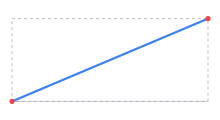 | `t` | Constant rate — versions are spaced evenly. |

#### Sine

_Gentle trigonometric acceleration._

| Curve | Shape | `awk` formula `e(t)` | Behavior |
|---|---|---|---|
| `easeInSine` | 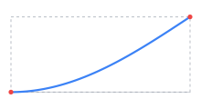 | `1-cos(t*pi/2)` | slow start, fast finish (growth back-loaded). |
| `easeOutSine` | 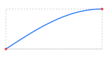 | `sin(t*pi/2)` | fast start, slow finish (growth front-loaded). |
| `easeInOutSine` | 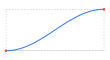 | `-(cos(pi*t)-1)/2` | slow at both ends, fast in the middle. |

#### Quad

_Mild polynomial acceleration (t²)._

| Curve | Shape | `awk` formula `e(t)` | Behavior |
|---|---|---|---|
| `easeInQuad` | 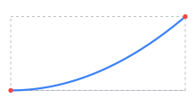 | `t*t` | slow start, fast finish (growth back-loaded). |
| `easeOutQuad` | 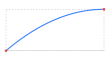 | `1-(1-t)*(1-t)` | fast start, slow finish (growth front-loaded). |
| `easeInOutQuad` | 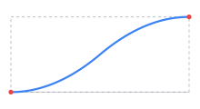 | `(t<0.5)?(2*t*t):(1-(-2*t+2)^2/2)` | slow at both ends, fast in the middle. |

#### Cubic

_Stronger acceleration (t³)._

| Curve | Shape | `awk` formula `e(t)` | Behavior |
|---|---|---|---|
| `easeInCubic` | 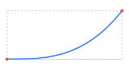 | `t^3` | slow start, fast finish (growth back-loaded). |
| `easeOutCubic` | 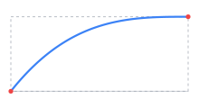 | `1-(1-t)^3` | fast start, slow finish (growth front-loaded). |
| `easeInOutCubic` | 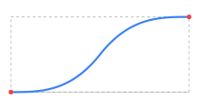 | `(t<0.5)?(4*t^3):(1-(-2*t+2)^3/2)` | slow at both ends, fast in the middle. |

#### Quart

_Steep acceleration (t⁴)._

| Curve | Shape | `awk` formula `e(t)` | Behavior |
|---|---|---|---|
| `easeInQuart` | 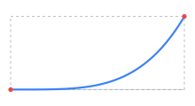 | `t^4` | slow start, fast finish (growth back-loaded). |
| `easeOutQuart` | 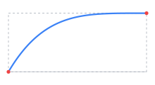 | `1-(1-t)^4` | fast start, slow finish (growth front-loaded). |
| `easeInOutQuart` | 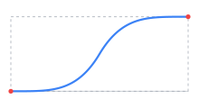 | `(t<0.5)?(8*t^4):(1-(-2*t+2)^4/2)` | slow at both ends, fast in the middle. |

#### Quint

_Very steep acceleration (t⁵)._

| Curve | Shape | `awk` formula `e(t)` | Behavior |
|---|---|---|---|
| `easeInQuint` | 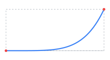 | `t^5` | slow start, fast finish (growth back-loaded). |
| `easeOutQuint` | 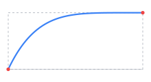 | `1-(1-t)^5` | fast start, slow finish (growth front-loaded). |
| `easeInOutQuint` | 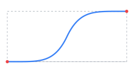 | `(t<0.5)?(16*t^5):(1-(-2*t+2)^5/2)` | slow at both ends, fast in the middle. |

#### Expo

_Extreme: almost flat, then explosive (2^t)._

| Curve | Shape | `awk` formula `e(t)` | Behavior |
|---|---|---|---|
| `easeInExpo` | 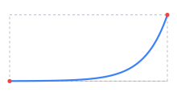 | `(t==0)?0:(2^(10*t-10))` | slow start, fast finish (growth back-loaded). |
| `easeOutExpo` | 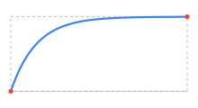 | `(t==1)?1:(1-2^(-10*t))` | fast start, slow finish (growth front-loaded). |
| `easeInOutExpo` | 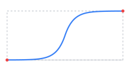 | `(t==0)?0:((t==1)?1:((t<0.5)?(2^(20*t-10)/2):((2-2^(-20*t+10))/2)))` | slow at both ends, fast in the middle. |

#### Circ

_Circular arc — abrupt near one end._

| Curve | Shape | `awk` formula `e(t)` | Behavior |
|---|---|---|---|
| `easeInCirc` | 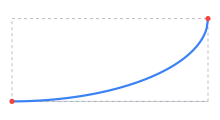 | `1-sqrt(1-t^2)` | slow start, fast finish (growth back-loaded). |
| `easeOutCirc` | 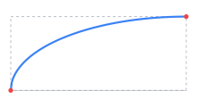 | `sqrt(1-(t-1)^2)` | fast start, slow finish (growth front-loaded). |
| `easeInOutCirc` | 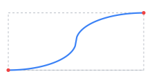 | `(t<0.5)?((1-sqrt(1-(2*t)^2))/2):((sqrt(1-(-2*t+2)^2)+1)/2)` | slow at both ends, fast in the middle. |

#### Back

_Overshoots slightly past the bound before settling (anticipation)._

| Curve | Shape | `awk` formula `e(t)` | Behavior |
|---|---|---|---|
| `easeInBack` | 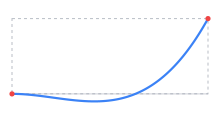 | `c3*t^3-c1*t^2` | slow start, fast finish (growth back-loaded). |
| `easeOutBack` | 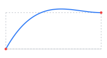 | `1+c3*(t-1)^3+c1*(t-1)^2` | fast start, slow finish (growth front-loaded). |
| `easeInOutBack` | 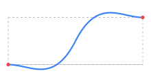 | `(t<0.5)?((2*t)^2*((c2+1)*2*t-c2))/2:((2*t-2)^2*((c2+1)*(2*t-2)+c2)+2)/2` | slow at both ends, fast in the middle. |

#### Elastic

_Springs / oscillates around the bounds (rubber-band)._

| Curve | Shape | `awk` formula `e(t)` | Behavior |
|---|---|---|---|
| `easeInElastic` | 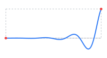 | `(t==0)?0:((t==1)?1:(-(2^(10*t-10))*sin((10*t-10.75)*c4)))` | slow start, fast finish (growth back-loaded). |
| `easeOutElastic` | 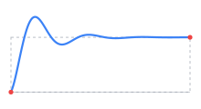 | `(t==0)?0:((t==1)?1:((2^(-10*t))*sin((10*t-0.75)*c4)+1))` | fast start, slow finish (growth front-loaded). |
| `easeInOutElastic` | 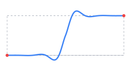 | `(t==0)?0:((t==1)?1:((t<0.5)?(-(2^(20*t-10))*sin((20*t-11.125)*c5))/2:(2^(-20*t+10))*sin((20*t-11.125)*c5)/2+1))` | slow at both ends, fast in the middle. |

#### Bounce

_Bounces like a ball coming to rest._

| Curve | Shape | `awk` formula `e(t)` | Behavior |
|---|---|---|---|
| `easeInBounce` | 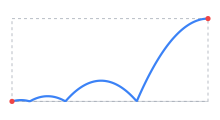 | `1-bounceOut(1-t)` | slow start, fast finish (growth back-loaded). |
| `easeOutBounce` | 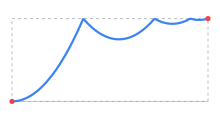 | `bounceOut(t)` | fast start, slow finish (growth front-loaded). |
| `easeInOutBounce` | 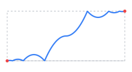 | `(t<0.5)?((1-bounceOut(1-2*t))/2):((1+bounceOut(2*t-1))/2)` | slow at both ends, fast in the middle. |

#### Periodic (multiple data acquisition)

_Repeat `--patterns` times to model several successive acquisition campaigns. The `awk` expression reads `patterns` from `--patterns`; the plots below use `--patterns = 3`._

| Curve | Shape | `awk` formula `e(t)` | Behavior |
|---|---|---|---|
| `sineWave` | 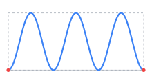 | `(1-cos(2*pi*patterns*t))/2` | Oscillates `--products` ↔ `--target` `patterns` times, returning to `--products` — acquire then release each cycle (diffs alternate additions/deletions). |
| `sineStairs` | 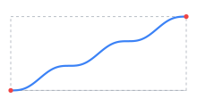 | `t-sin(2*pi*patterns*t)/(2*pi*patterns)` | Grows monotonically to `--target` in `patterns` steps — data accumulated over `patterns` campaigns. |

> **Custom curves.** Any value that is not a known curve name is treated as a custom `awk` expression of `t`, so you can supply your own (e.g. `-e 't*t*t'`, equivalent to `easeInCubic`). A custom expression must reference `t`; a bare word or a constant is rejected to avoid silently flattening every version. Custom expressions may also use `patterns` (the `--patterns` value) to build their own periodic curve, e.g. `-e '(1-cos(2*pi*patterns*t))/2' -P 4`.
>
> The illustrations above plot these exact `awk` expressions (the same ones defined in `generate-n`).

Examples:
```bash
# 5 versions ramping from 100 to 5000 products along an ease-in/out sine curve
docker run -v "$PWD:/app/data" vcity/bsbm generate-n -v 5 -p 100 -t 5000 -e easeInOutSine

# Front-loaded growth via a custom expression
docker run -v "$PWD:/app/data" vcity/bsbm generate-n -v 5 -p 100 -t 5000 -e 'sqrt(t)'

# Multiple data acquisition: 3 campaigns accumulating to 5000 products (13 versions)
docker run -v "$PWD:/app/data" vcity/bsbm generate-n -v 13 -p 100 -t 5000 -e sineStairs -P 3

# Multiple data acquisition: 3 acquire-then-release cycles between 100 and 5000 products
docker run -v "$PWD:/app/data" vcity/bsbm generate-n -v 13 -p 100 -t 5000 -e sineWave -P 3
```

### Diff output files
For each version >= 2, `generate-n` automatically computes the RDF diff between consecutive versions and outputs:
- `dataset-X_additions.nt`: triples present in version X but not in version X-1
- `dataset-X_deletions.nt`: triples present in version X-1 but not in version X

These files are always generated in N-Triples format regardless of the `--format` option, since they are computed by comparing sorted N-Triples representations of each version.

If you want more information about the different arguments, please refer to the original documentation.

```bash
docker run vcity/bsbm generate -help
docker run vcity/bsbm generate-n -help
docker run vcity/bsbm qualification -help
docker run vcity/bsbm testdriver -help
```

$PWD is the directory where the data will be stored.
You can change it to any directory you want.

## Modifications from source:
**Dockerfile:**
- Added new authors
- Dockerized the benchmark

**entrypoint.sh**
- Added a new entrypoint script to run the benchmark